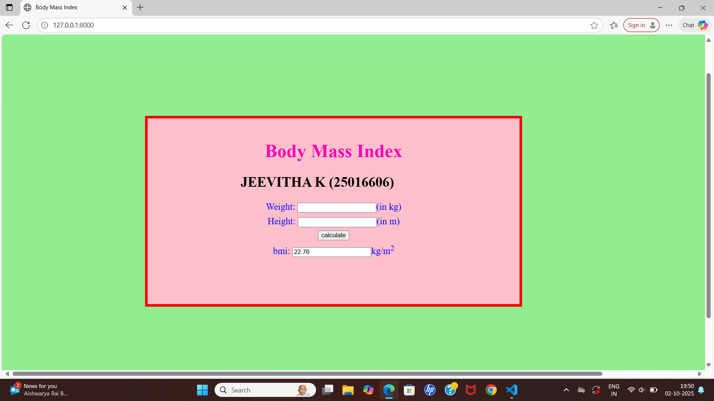

# Ex.05 Design a Website for Server Side Processing
## Date:03.10.2025

## AIM:
 To design a website to calculate the Body Mass Index (BMI) in the server side. 


## FORMULA:
BMI =W/H<sup>2</sup>
<br> BMI --> Body Mass Index
<br> W --> Weight
<br> H --> Height

## DESIGN STEPS:

### Step 1:
Clone the repository from GitHub.

### Step 2:
Create Django Admin project.

### Step 3:
Create a New App under the Django Admin project.

### Step 4:
Create python programs for views and urls to perform server side processing.

### Step 5:
Create a HTML file to implement form based input and output.

### Step 6:
Publish the website in the given URL.

## PROGRAM :
```
math.html
<html>
<head>
<title>Body Mass Index</title>
<style>
body {
    background-color:lightgreen;
}

.edge {
    width: 1440px;
    margin-left: auto;
    margin-right: auto;
    padding-top: 250px;
    padding-left: 300px;
    padding-bottom: 250px;
}
.box {
    display: inline-block;
    border: solid 6px red;
    width: 400px;
    height: 400px;
    font-size: 20px;
    padding-left: 200px;
    padding-right: 200px;
    background-color: pink;


}
.formelt {
    color: blue;
    text-align: center;
    margin-top: 7px;
    margin-bottom: 7px;
}
h1 {
    color: rgb(255,0,179);
    text-align: center;
     padding-top: 20px;
}
</style>
</head>
<body>
<div class="edge">
<div class="box">
    <h1 align:"center">Body Mass Index</h1>
    <h2>JEEVITHA K (25016606)</h2>
    <form method="POST" action="">
        
        <div class="formelt">
            Weight: <input type="text" name="weight" value="{{weight}}" align:"center"></input>(in kg)<br/>
        </div>
        <div class="formelt">
            Height: <input type="text" name="height" value="{{height}}" align:"center"></input>(in m)<br/>
        </div>
        <div class="formelt">
            <input type="submit" value="calculate" align:"center"></input><br/>
        </div>
        <div class ="formelt">
            
            bmi: <input type="text" name="bmi" value="{{bmi}}" align:"center"></input>kg/m<sup>2</sup><br/>
            
        </div>
    </form>
</div>
</div>
</body>
</html>


views.py
from django.shortcuts import render
def calculate_BMI(request):
    bmi=None
    weight=None
    height=None
    if request.method=="POST":
        weight=float(request.POST.get("weight"))
        height=float(request.POST.get("height"))/100
        bmi=weight/(height**2)
        bmi=round(bmi,2)
        print(f"1weight in kg:{weight}, Height in m:{height},bmi: {bmi}")
    return render(request, 'myapp/math.html',{'bmi':bmi})

urls.py
from django.urls import path
from myapp import views
urlpatterns=[
             path('admin/',admin.site.urls),
             path('',views.calculate_BMI,name='home'),
             path('bmi/',views.calculate_BMI,name='bmi'),
            ]


```


## SERVER SIDE PROCESSING:
.png>)

## HOMEPAGE:


## RESULT:
The program for performing server side processing is completed successfully.
